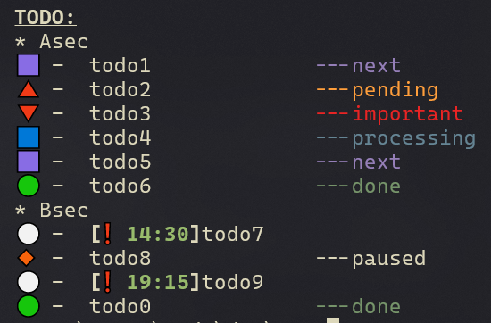
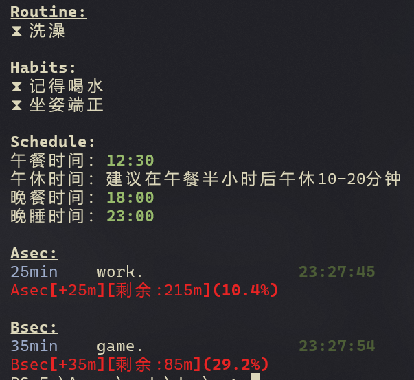

# rv
- Time and Task Management Tools , Normal Vital Signs Maintenance Tools

- 时间和任务管理工具，正常生命体征维持工具

写这个程序是为了能通过尽可能简单的方式多注意自己的生活，保持相对还算健康的状态

但这个程序就是熬夜写出来的(

# Install
    git clone https://github.com/CHrXD777/rv.git
    
1. 将本仓库克隆到任何你想要的地方
2. 将仓库路径添加到path
3. 设置别名：
``` powershell
function rav {
    python.exe rv.py
}
function roo {
	python.exe rv.py oo
}
function rod {
	python.exe rv.py od
}
function rox {
	python.exe rv.py ox
}
function rii {
	python.exe rv.py ii
}
function rid {
	python.exe rv.py id
}
function rigc {
	python.exe rv.py igc
}
function rig {
	python.exe rv.py ig
}
function ria {
	python.exe rv.py ia
}
function rarchive {
	python.exe rv.py archive
}
function rwhataday {
	python.exe rv.py whataday
}
```
# Usage
## 子命令：
### TODO部分
1. od    -    tOdo eDit, 打开或编辑todo.norg
2. oo    -    tOdo list, 展示todo list
3. ox    -    tOdo neXt, 将当前任务状态更新为完成，并将下一任务设置为正在处理
### 时间部分
1. igc    -    通过询问和编辑生成每日时间记录配置文件
2. ig    -    生成今日的时间记录文件
3. ia    -    添加时间记录到time.norg 文件 <str:时间+45m或_30m)> <str:任务描述>
4. id    -    打开或编辑time.norg
5. ii    -    解析并展示当日的 time.norg 文件内容
### 总结归档
1. whataday    -    归档当日的todo.norg和time.norg
2. archive    -    打开归档文件夹

## 使用逻辑
通过igc设置当日时间安排，包括午饭晚饭时间，以及可以在习惯池和日常事项(/config/time_tmpl.norg中设置模板，-（d）代表当日不启用)中选择当日是否启用

通过ig生成当日time.norg文件

可以用ia添加时间事件，比如`rv ia _45m game.` 或 `rv ia +25m work.`,时间前的符号决定事项推送到哪个section，Asec表示积累类的事项，加算时间，偏向学习、工作类；Bsec表示消耗类的事项，越用越少，偏向游戏、放松类。

其他的子命令大概都很明白了。

#Roadmap
1. 可能会加定时提醒功能(win系统下，在右下角发送通知)
2. 交互处理得更有趣一些，比如老科幻中人工智能的感觉
3. 不会加入计时功能

#ScreenShot



